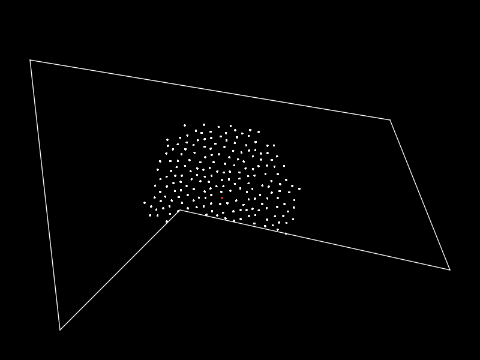

# luaFortune ###################################################################

## Introduction ################################################################

A bunch of libraries for various forms of procedural generation, including lots
of methods for subdividing a plane.

The eventual goal of the library is to become a goto, for resources pertaining
to the creation of procedural content generation algorithms.

The license is extremely dismissive, so feel free to look at, copy and learn
from the code. This project is a way to spread the joy of procedural generation.

Currently the library contains:

-   **Voronoi**: By using Fortune's Algorithm, it is possible to quickly and
    easily generate a voronoi tessellation of a space with any set of points.
    See the `Voronoi` module.
-   **Binary Space Partioning**: A technique usually used for storing points, it
    can be used for dividing a space into interestingly formed areas.
    See the `bsp` module.
-   **Random Points**: Module for generating a large number of points, with
    different noise frequencies. Allows generating within any arbitrary polygon.
    See the `points` module.

Future Expansion:

-   **Tiling**: Sometimes even basic shapes are useful, and this module will
    help with that.
-   **(Fractal) Textures**: Through the use of Perlin, Simplex or OpenSimplex
    this module will allow the easy creation of fractal textures, even in higher
    dimensions.
-   **Delaunay**: The opposite of Voronoi, this tessellation is just as useful.
    Expect an implementation of Ruppert's Algorithm.
-   **Markov Chains**: A simple prediction algorithm, which can be used for
    name generation and more.

## Overview ####################################################################

Below is the documentation for the project in general, including how to install.
If you'd rather look at the docs for a specific module:

-   [**Voronoi**](docs/voronoi.md)
-   [**Binary Space Partioning**](docs/bsp.md)
-   [**Random Points**](docs/random_points.md)

## Examples ####################################################################

I've told you a lot of fancy words, but obviously you just want some pretty
things to look at. Well, look no further.

The following examples were implemented in [LÖVE](https://love2d.org/).




## How to Use ##################################################################

### Dependencies & Installation ################################################

The library has been tested with `PUC Lua 5.1` and `LuaJIT 2.0.3`. Other
versions of Lua may or may not work. I'd appreciate users of other Lua versions
to test and report their findings to me.

No external libraries required. The modules are plug-and-play. No internal
dependencies either.

For installation, simply drop the module you want into your directory of choice,
and it should work nicely.

### Tests ######################################################################

Tests for the modules can be found in the `test` directory.

For reasons I cannot discern tests must be run in either the `test` directory
or in the `test/[module]` directory.

The `main.lua` file in each test directory, is the main file for a LÖVE project.
Running the folder with love will show some nice visual tests of the module.

## Further Reading #############################################################

In case you're lusting for ways to use these tools, take a look at the following
pages.

-   [Polygonal Map Generation for Games](http://www-cs-students.stanford.edu/~amitp/game-programming/polygon-map-generation/)
    by **Red Blob Games**: The very article that introduced me to voronoi
    graphs. The site is extremely informative, gives a nice overview of how to
    use the graph for map generation, and present a large number of ideas to the
    reader.
-   [Visualizing Algorithms](http://bost.ocks.org/mike/algorithms/) by **Mike
    Bostock**: An incredibly useful page for understanding how various
    algorithms work. 

## Contributing ################################################################

If you have ideas for features or faster algorithms and know how to code, please
feel free to share. I'd love to expand the library with more features useful for
map makers.

There are just there few points to consider before you contribute:

-   **The Maintainer**: I survey everything going in. Don't worry, the bar isn't
    high, and I'll come with considerable response, in case anything doesn't
    make it.
-   **The Code**: I'm not picky when it comes to code, but please try to
    maintain the theme, and general interface.
-   **The License**: Please be aware that anything you submit becomes covered
    under the license. This may not be what you intended, think about it first.

## License #####################################################################

As previously stated, the license is extremely permissive. This project is
really about sharing what I've learned, and spreading the joy that is
procedural generation.

Feel free to do anything with the code, including learning, sharing and using
it in any project, be they commercial or otherwise.

### THE BEER-WARE LICENSE ######################################################

```text
<jonjmaa@gmail.com> wrote this library.  As long as you include a namedrop
you can do whatever you want with this stuff. If we meet some day, and you
think this stuff is worth it, you can buy me a beer in return.
- Jon Michael Aanes
```

# Credits ######################################################################

Library made by:

-   _Jon Michael Aanes_ (2015)

Kudos to:

-   _deströyer_ on the LÖVE forums, for helping with the face finding algorithm.

Formal thanks go to (Voronoi):

-   _Steve J. Fortune_ (1986) for his paper "A sweepline algorithm for Voronoi
    diagrams.", which described the algorithm named after him: "Fortune's
    Algorithm", and for publishing the original C code.
-   _Matt Brubeck_ (2002) for
    [his C++ port](https://www.cs.hmc.edu/~mbrubeck/voronoi.html), which
    this implementation of Fortune's Algorithm is heavily based on.
