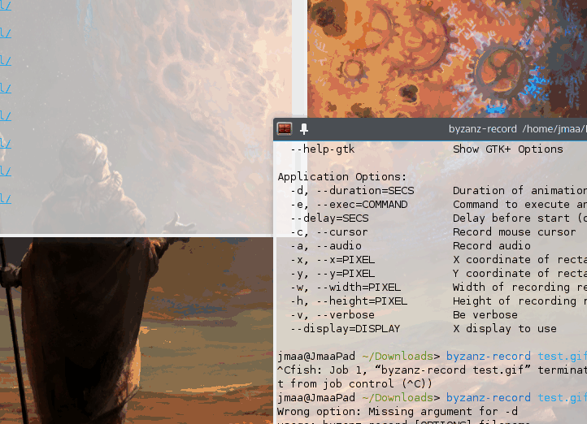

# Voronoi ######################################################################

## Introduction ################################################################

A simple algorithm for dividing a plane into smaller polygons.

Very useful for map generation, or generally just dividing the plane.



## How To Use ##################################################################

### Dependencies & Installation ################################################

Plug-and-play, no internal or external dependencies.

### Quick Start ################################################################

The primary exposed function of the module is `bsp.generate_bsp`. It's arguments
are a polygon (a list of points, defined clockwise), a condition function (more
on this later), and a maximum amount of iterations (which if omitted is set at
infinity):

    bsp.generate_bsp(Polygon, Condition, [number]) -> PointRelation

The most important of these arguments is the condition function argument. This
can be any function of a specific format: It should accept a polygon, and return
which sides and how far along those sides, the new connecting line is going to
be placed. E.g it should have following format:

    function(Polygon) -> Point, Point, number, Point, Point, number

Some factories for Conditions can be found in the `bsp.condition` table.

You might have noticed that `bsp.generate_bsp` returns a strange thing called
a `PointRelation`. This is simply a smart data structure for storing how
points connect to other points. You can convert it into a list of edges by using
`bsp.get_edges_from_relations`:

    bsp.get_edges_from_relations(PointRelation) -> list<Edge>

Example:
```lua
local bsp = require "bsp"
local polygon = {
    bsp.new_point(0,0),
    bsp.new_point(1,0),
    bsp.new_point(1,1),
    bsp.new_point(0,1)
}
local condition = bsp.condition.split_by_middle(0.1,0.5)
local point_relations = bsp.generate_bsp(polygon, condition)
local edges = bsp.get_edges_from_relations(point_relations)

print("Edges: ")
for i, edge in ipairs(edges) do
    print("-",edge.p1.x,edge.p1.y,edge.p2.x,edge.p2.y)
end
```

### "Full Documentation" #######################################################

Exposed functions:

-   `bsp.new_point(number, number)`: Returns a `Point`.
-   `bsp.generate_bsp(Polygon, Condition, [number])`: Generates the bsp and
    returns a PointRelation, with the generated graph.
-   `bsp.get_edges_from_relations(PointRelation)`: Produces a `list<Edge>` from
    PointRelation.

Exposed variables:

-   `bsp.version`: The current version of the module.

Default Condition factories:

-   `bsp.condition.split_by_middle(number, number)`: Arguments are (1) the maximum
    area a section will be split, and (2) the randomness of the line (0 is none,
    1 is a lot). Will spit out a Condition, based on those arguments.

## License & Credits ###########################################################

The license can be found in `LICENSE.txt`, or along with the credits in [in the
top level documentation](../README.md).
