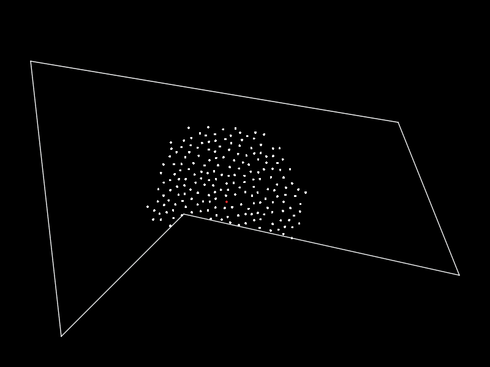

# Random Points ################################################################

## Introduction ################################################################

Implementations of various point generation algorithms. Included is functions
for generating white noise and blue noise points, both within a rectangle, and
in any arbitrary polygon.

Very useful for creating distributed points. Fits perfectly with the other
modules of the library.



## How To Use ##################################################################

### Dependencies & Installation ################################################

Plug-and-play, no internal or external dependencies.

### Quick Start ################################################################

Currently the module support two types of point generation:
-   *White Noise*: There is equal chance of the point being placed in any valid
    position. This often results in clustering, or some areas being sparse. This
    is a really fast and simple algorithm, and the resulting number of points
    can be guaranteed.
-   *Blue Noise*: Points cannot lie too close to each other. This results in a
    much more uniform distribution of points, with no clustering nor sparseness.
    This algorithm is slow, complex and cannot guarantee a specific number of
    points.

Example:

```lua
local random_points = require "random_points"

local points = random_points.white_noise(0, 1, 0, 1, 100)
print("Points:")
for _, point in ipairs(points) do
    print("- "..point.x..", "..point.y)
end

local points = random_points.blue_noise(0, 1, 0, 1, 7, 0.1)
print("Points:")
for _, point in ipairs(points) do
    print("- "..point.x..", "..point.y)
end

local polygon = { {x=0,y=0}, {x=1,y=0}, {x=1,y=1}, {x=0,y=1} }
local points = random_points.blue_noise_polygon(polygon, 7, 0.1)
print("Points:")
for _, point in ipairs(points) do
    print("- "..point.x..", "..point.y)
end
```

### "Full Documentation" #######################################################

Exposed functions:

-   `random_points.white_noise(number, number, number, number, number,
    [function])`: First four arguments are the minimum and maximum x and
    y values, while fifth is how many points to generate. The optional argument
    is an alternative random function to use instead of the default. Returns
    `list<Points>`.
-   `random_points.white_noise_polygon(Polygon, number, [function])`: Pretty
    much the same as above, just instead of the rectangle limits, just give a
    polygon. Returns `list<Points>`.
-   `random_points.blue_noise(number, number, number, number, number, number,
    [function])`: The first four and the last are exactly as for `white_noise`.
    Argument five is the number of misses a point can generate before being
    skipped. A low number results in patterns, and a high number results in slow
    running times. Argument six is the minimum accepted distance between points.
-   `random_points.blue_noise_polygon(Polygon, number, number, [function])`:
    The polygon version of `blue_noise`.

Exposed variables:

-   `random_points.version`: The current version of the module.
-   `random_points.default_rnd_func`: The default random function. Can be
    overwritten, but must follow the same interface as `math.random`.

## License & Credits ###########################################################

The license can be found in `LICENSE.txt`, or along with the credits in [in the
top level documentation](../README.md).
